# Screenshot Collection Windows

## Tastenkürzel

- `Win+E` ... File Explorer öffnen
- `Win+I` ... Windows Settings
- `Strg+Shift+Esc` ... Taskmanager
- `Win+Shift+S` ... Screenshot
- `Win+R` ... Erweiterte Suche auf dem PC
- `Strg+C` ... Copy Text
- `Strg+V` ... Paste Text
- `Strg+X` ... Cut Out Text
- `Win+D` ... Alle offene Programme minimieren/maximieren
- `Strg+Win+D` ... Neuer Desktop
- `Strg+Win+<-/->` ... Zwischen Desktops wechseln
- `Strg+Win+F4` ... Aktuellen Desktop löschen
- `Strg+Shift+Win+Alt` ... Office App öffnen
- `Win+Tab` ... Zwischen offene Programme und Desktops wechseln
- `Alt+F4` ... Aktuelles Programm schließen oder Windows herunterfahren
- `Alt+Tab` ... Zwischen offene Programme wechseln  
- `Strg+T` ... im Browser einen neuen Tab öffnen
- `Strg+W` ... im Browser aktuellen Tab löschen
- `Strg+Tab` ... im Browser zwischen den Tabs nach rechts wechseln 
- `Strg+Shift+Tab` ... im Browser zwischen den Tabs nach links wechseln
- ...

## 1. Screenshot - Title

## 2. Speicherplatz `C:`

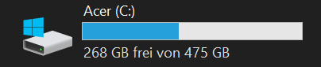

## 3. Dateisystem `C:`

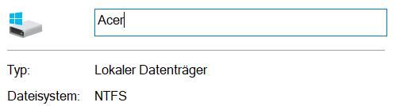

## 4. Zugriffsrecht des `C:\Windows`

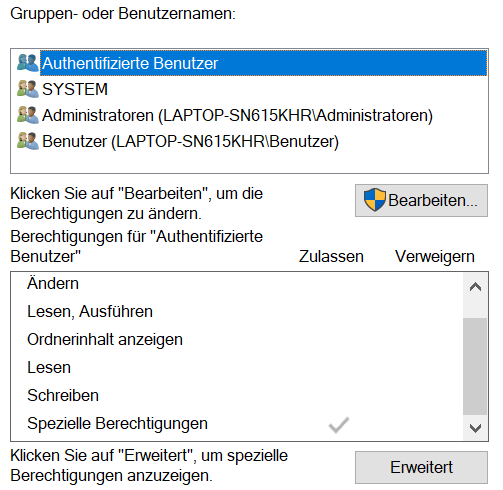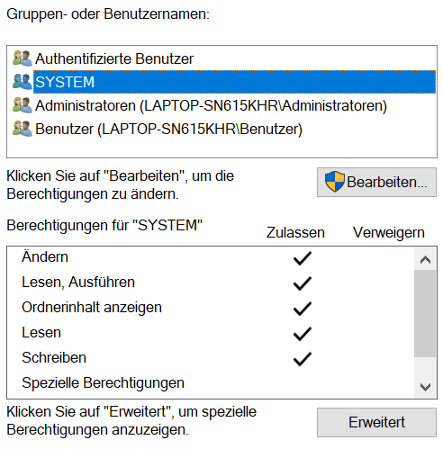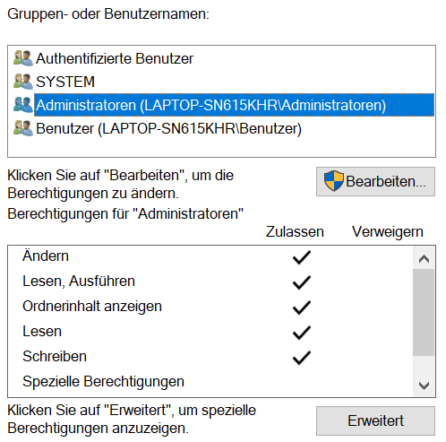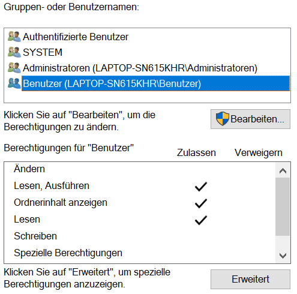

## 5. `Temp`-Ordner auf dem `C:`-Laufwerk

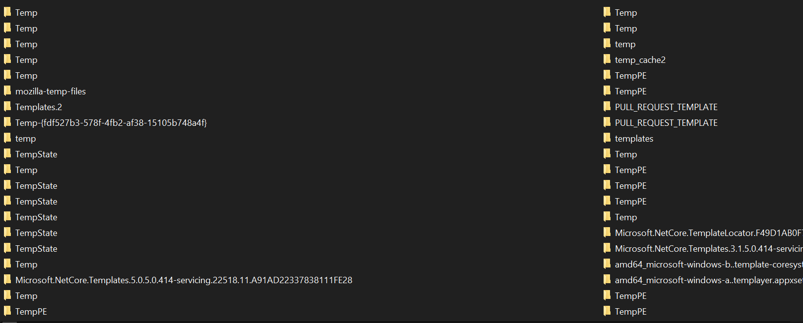

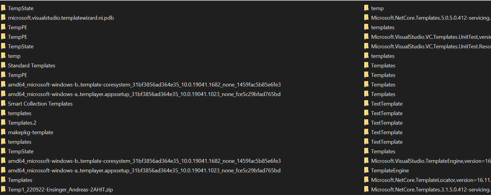

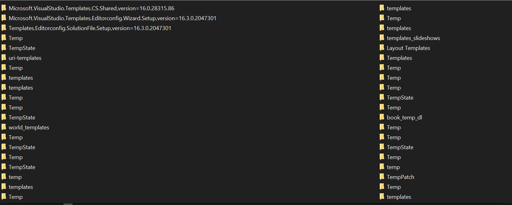

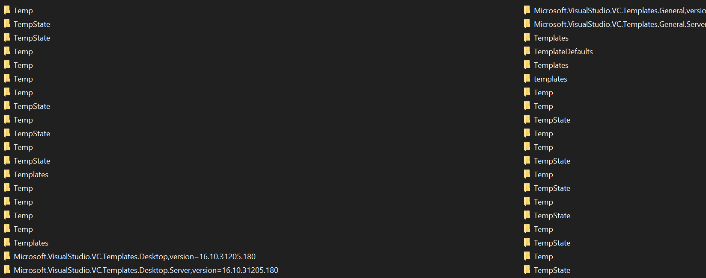

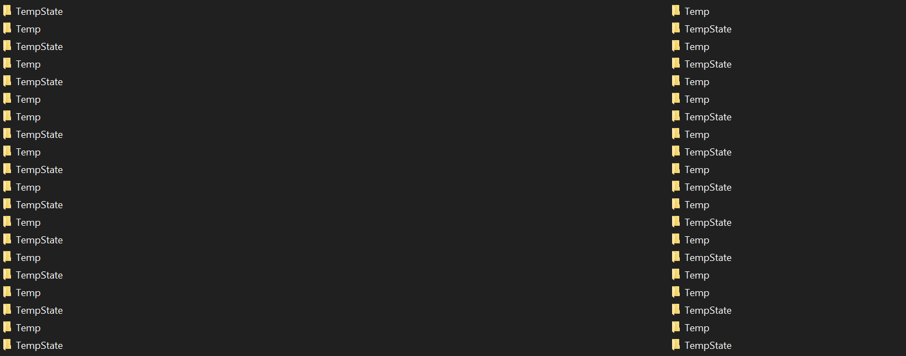

## 6. Grafikkartentreiber

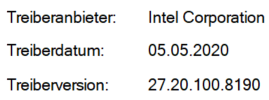

## 7. Task-Manager: Speicherverbrauch und Ethernet Troughput ansehen

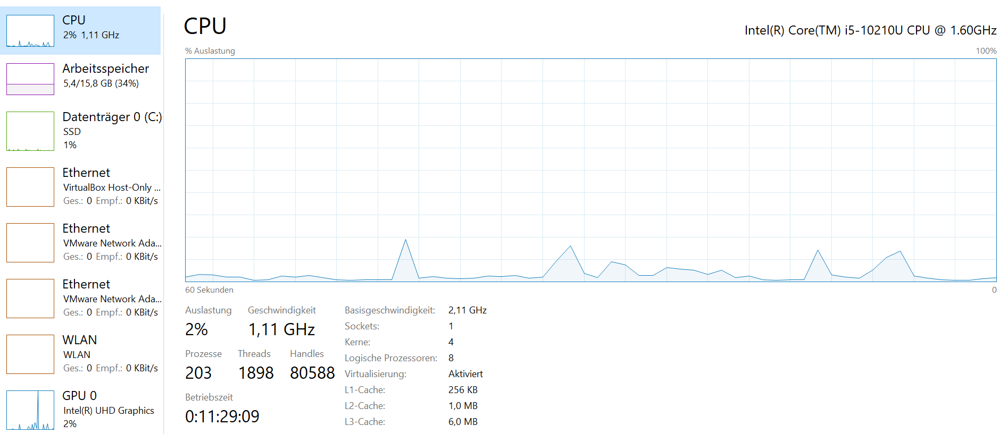

## 8. Taskmanager: Startup-Programme ansehen

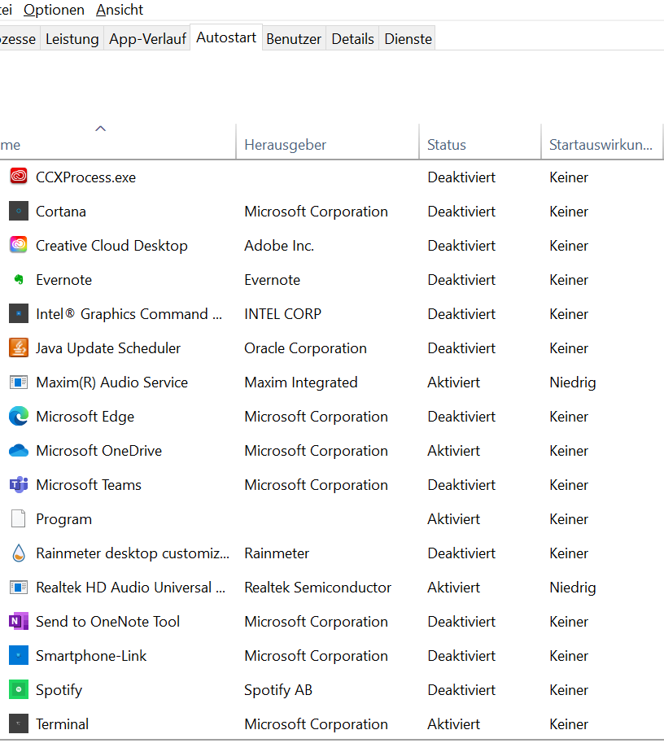

## 9. Diskmanagement: Partitionen der Laufwerke ansehen

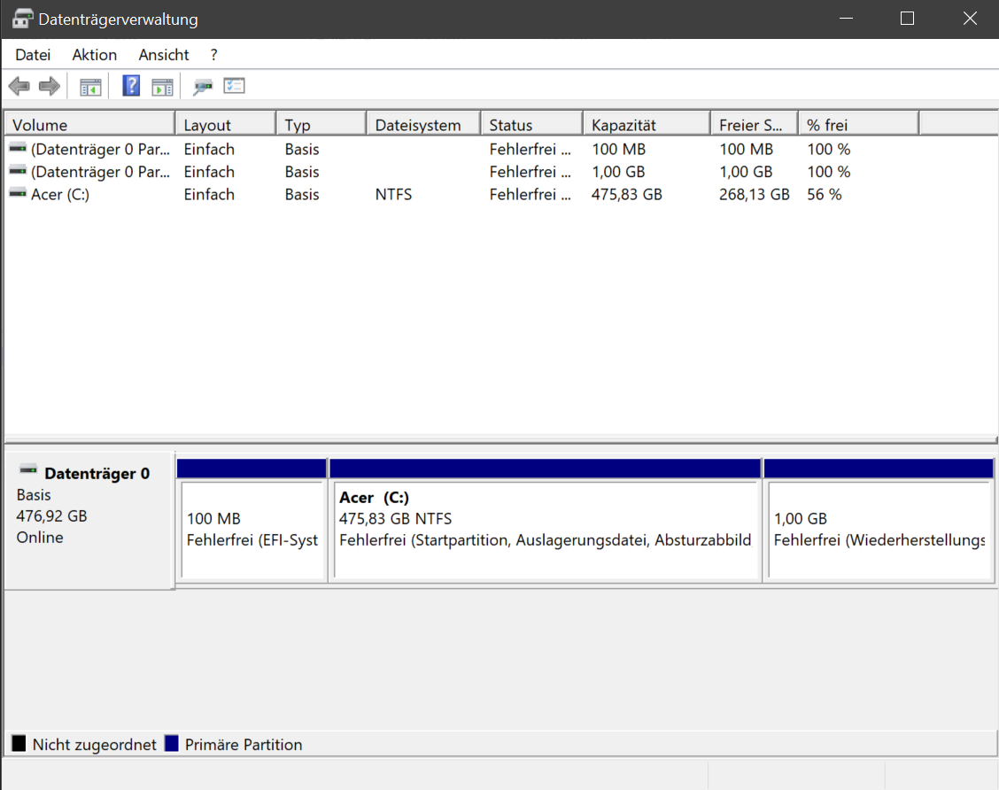

## 10. Einstellungen: unter Info, Device und Windows Spezifiaktionen ansehen

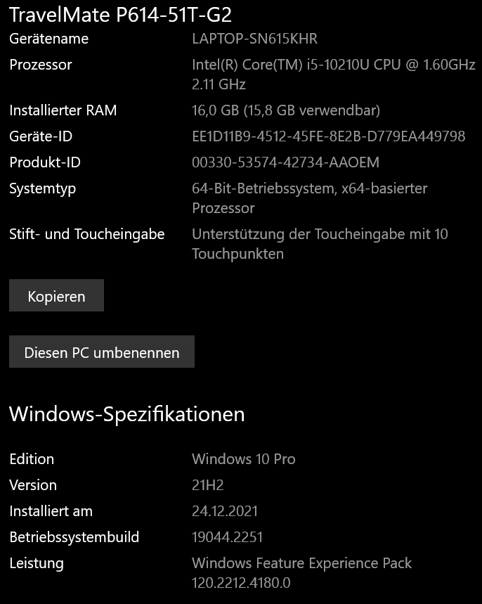

## 11. Einstellungen: Netzbetrieb und Energiesparmodus Settings ansehen

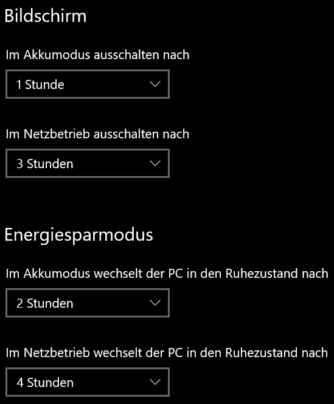

## 12. Computer Management: Task Schedule öffnen und die Tasks ansehen

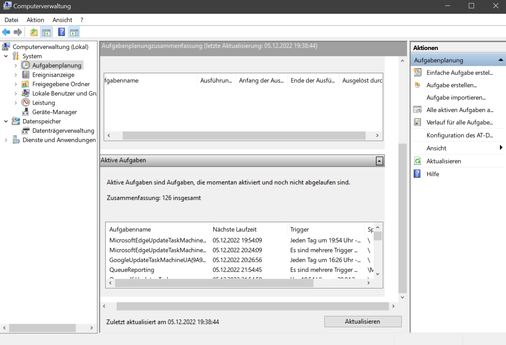

## 13. Einstellungen: Bildschirm Settings nachsehen ob die Textgröße skaliert ist

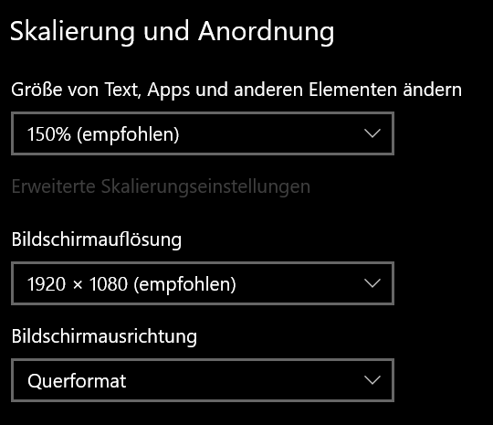

## 14. Terminal: alle Daten/Verzeichnisse auflisten

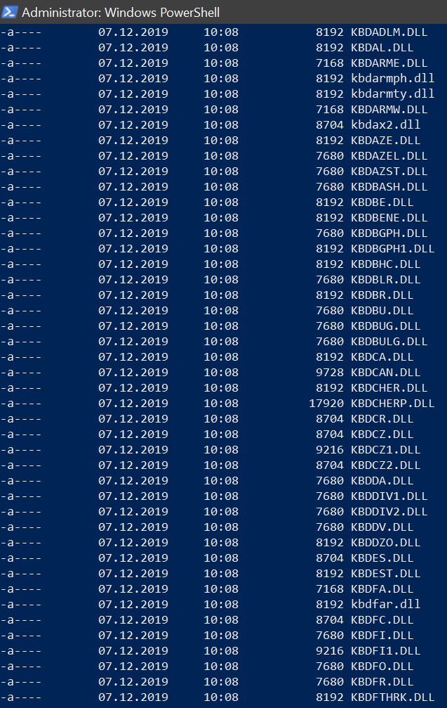

## 15. Terminal: alle mit Winget installierten Programme auflisten

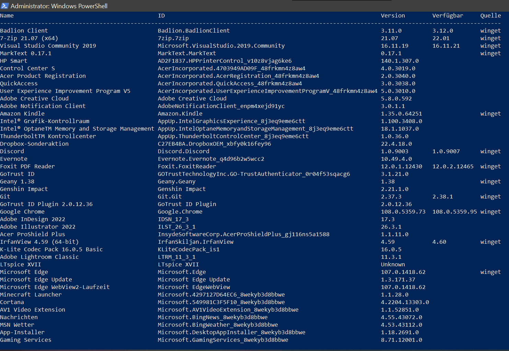
