# Screenshots WSL

## 1.

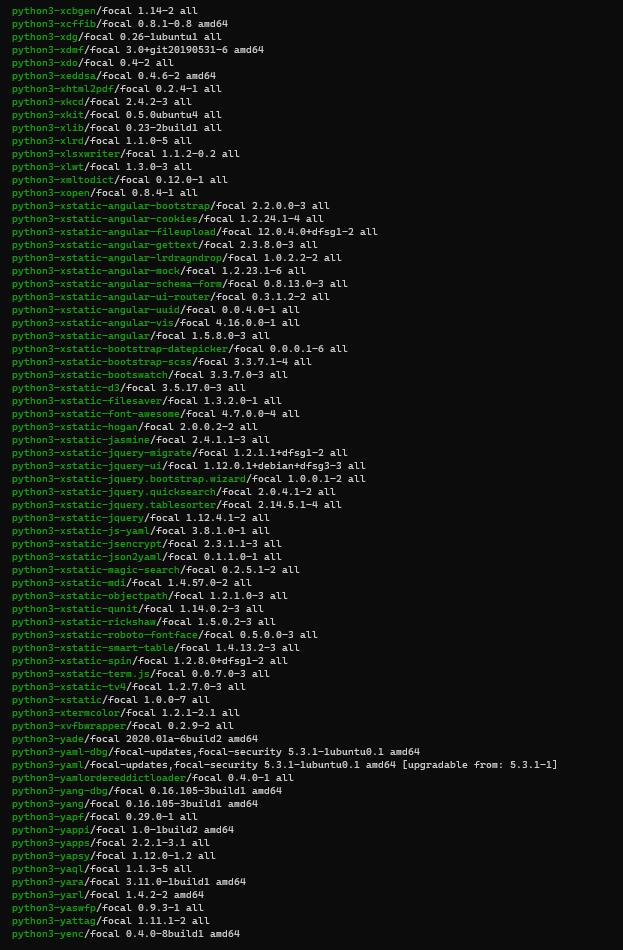

## 2.

## 3.

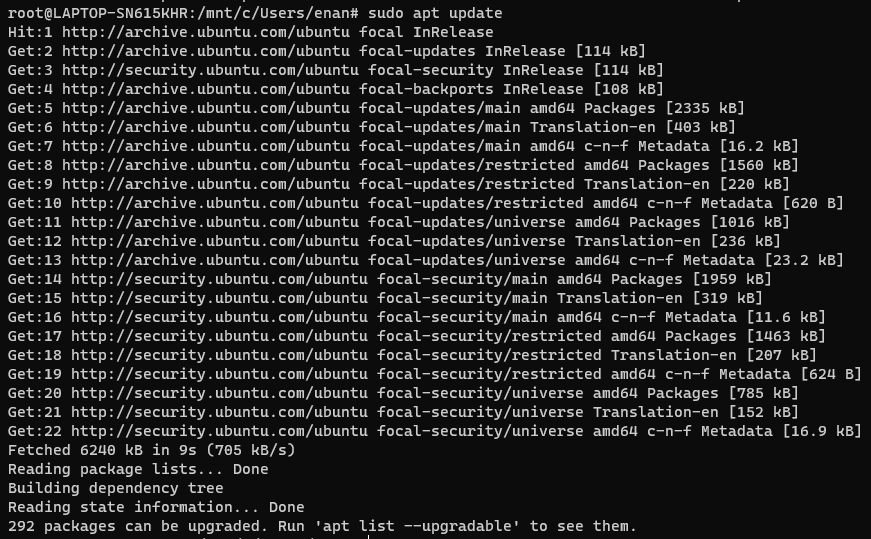

## 4.

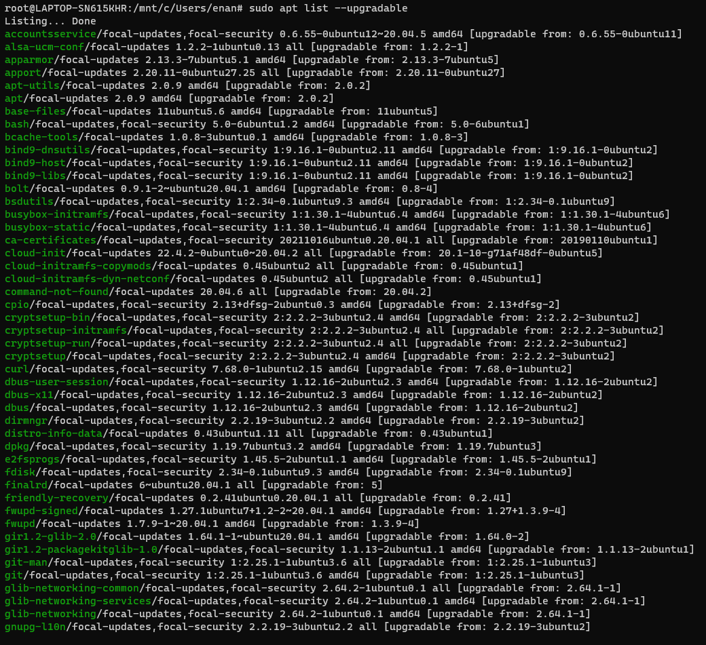

## 5.

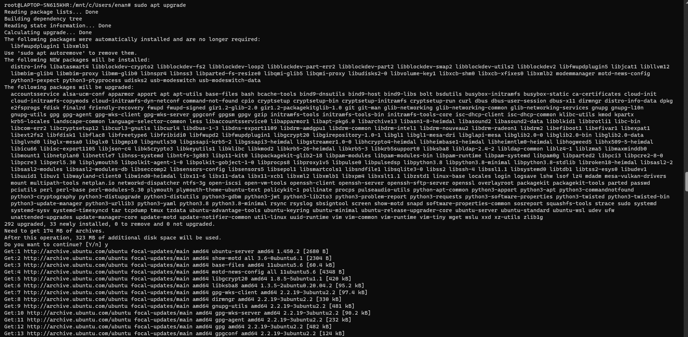

## 6.

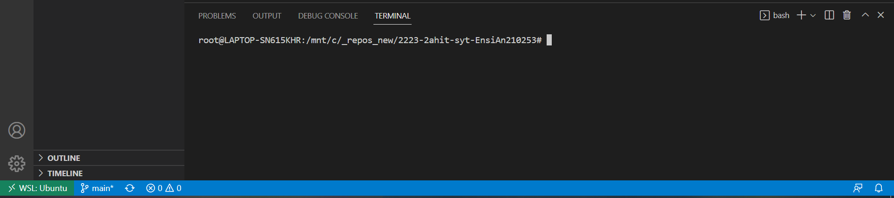

## 7.

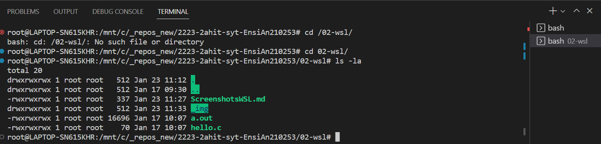

Strg+Shift+Ö

ls: listet Dateien und Ordner eines bestimmten Dateiverzeichnisses auf

-la: zeigt auch alle versteckte Dateien und Ordner sowie mehr Informationen an

## 8.

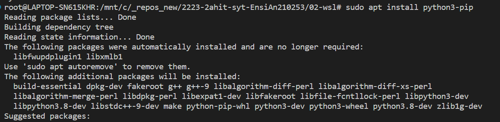

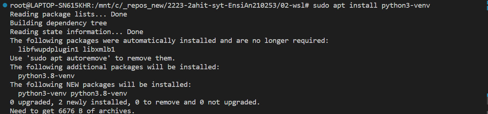

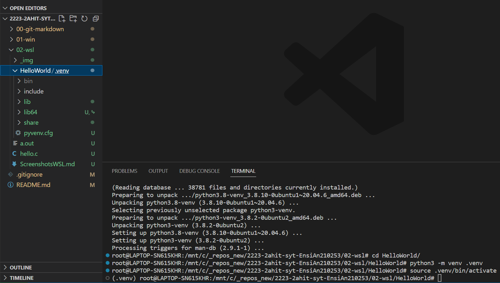

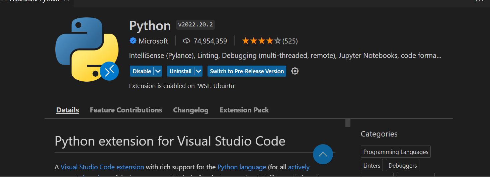

    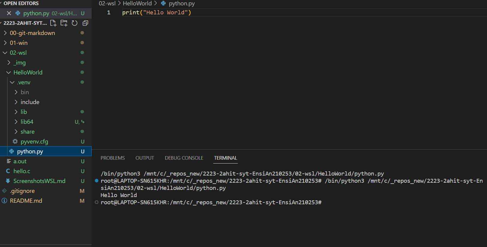

## Kali Linux

## 2.

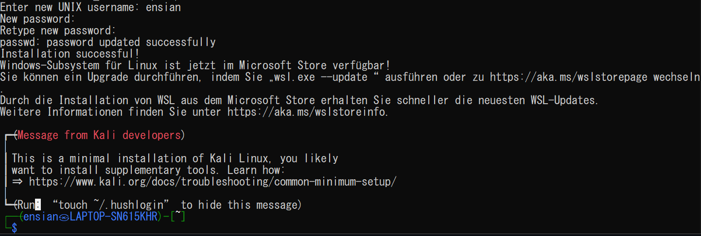

## 4.

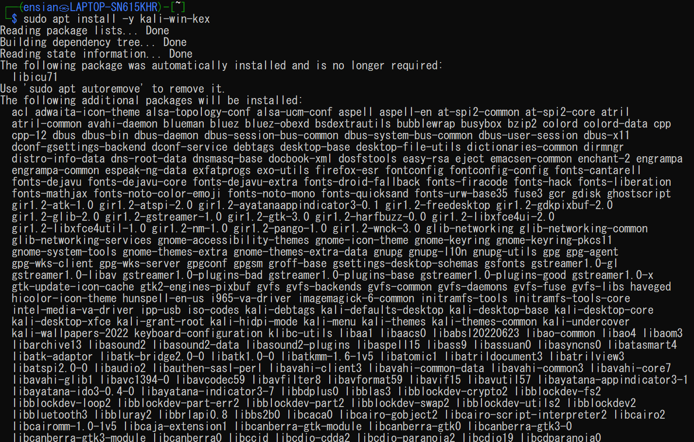

## 5.

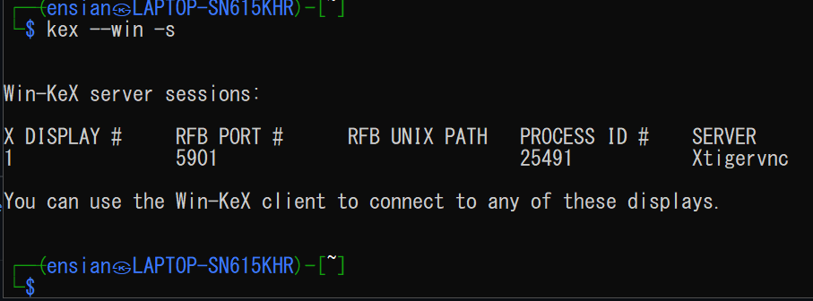
