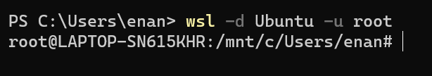

# Screenshots WSL

## 1.

## 2.

## 3.

## 4.

## 5.

## 6.

## 7.

Strg+Shift+Ö

ls: listet Dateien und Ordner eines bestimmten Dateiverzeichnisses auf

-la: zeigt auch alle versteckte Dateien und Ordner sowie mehr Informationen an

## 8.

    

## Kali Linux

## 2.

## 4.

## 5.

