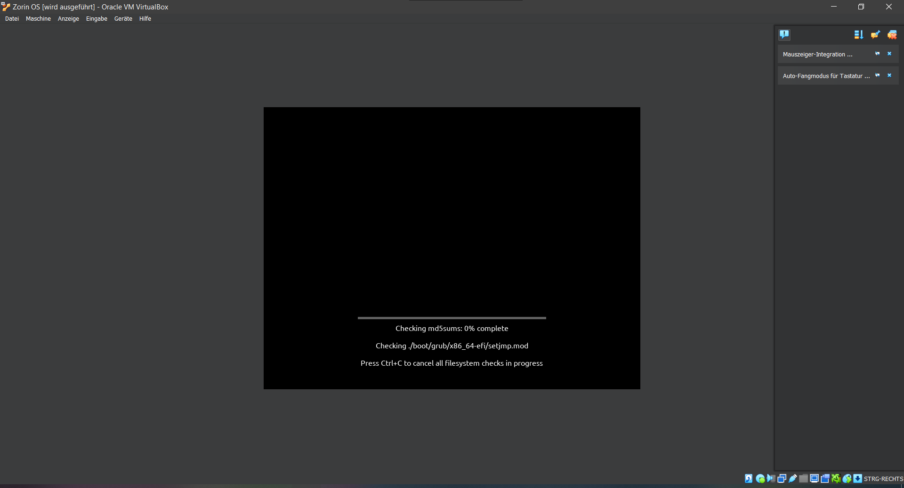

# Distribution

## Infos

- Distro: Zorin OS

- [DistroWatch.com: Zorin OS](https://distrowatch.com/table.php?distribution=zorin)

- [Download - Zorin OS](https://zorin.com/os/download/)

- Ich habe diese Distribution gewählt, da sie für Linux-Einsteiger gemacht worden ist, von der GUI her eine große Ähnlichkeit mit Windows hat und auch, weil es ähnliche Programme von diesem Betriebssystem auf Zorin OS gibt. Außerdem soll es auch eine Applikation zum Betriebssystem geben mit der man ein paar Windows Programme benutzen kann.

- 

## Installationserfahrung

Das Installationsfenster des Betriebssystems ist zu klein, manche Sachen sind abgeschnitten (man muss das Fenster nach links und rechts verschieben um das ganze richtig lesen zu können). -> _Problembehebung: Bildschirmauflösung ändern_

Ansonsten hat es alles problemlos installieren können.

_Da es nicht so viele Installationsschritte gab, habe ich auch alles gut verstehen können_

## Screenshots

